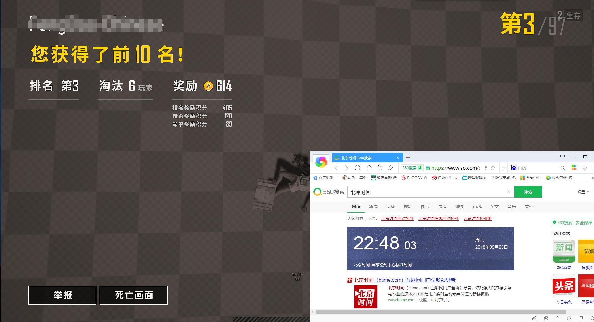

# PUBG-PAK-Hacker

<h1 align="center">
	
	 
	 
</h1>

<h1 align="center">
	
	 
	 
</h1>

# Update-2018/7/23

New bypass,it's works

This project can not work now.(18/6/7)

Sup all guys.

I know how to bypass BE for change PAK file.it's working now(2018/4/27)(2018/5/5)

if u can change(using?i dont know) PAK file.u can do evething u wanna.

all right.lets stop bullshit.just do it

1. ready PAK file.
2. create win mklink. (mklink K:/Game/Steam/blablabla/Paks/xxx.pak C:/1.pak) this step is necessary.if u dont want got 100 years ban
3. load start driver
4. delete u deriver file.just see Kernel_Force_Delete.cc
5. use MiProcessLoaderEntry hidden u driver. look at IO_Control.cc .ok.now ,who are u?i dont know.i guess BE too
6. when u eject from aircraft.hidden u pak file.look of MiniFilter-Monitor.cc
7. all right.enjoy killing.

## Q & A

##### how to get MiProcessLoaderEntry function address

 serach all kernel mode memory.ok,im joke,i take the address from user mode
 

##### are u cheating in pubg game?

before.nope.after.no!.never!

##### why we should hidden file and deriver.and delete file

1.i dont know why hidden file can bypass BE.but it's work

2 & 3. because BE serach memory.upload u driver file.it's really.listen.if u dont want banned.just do it.

##### how to get PAK file

from here: https://www.unknowncheats.me/forum/index.php

and i just know here.i dont know how to decrypt

##### wanna play with me?

welcome.but only ENG JP CN language speaker and legit player.(im noob)

##### where is complete code?

sorry .i cant give u.

### Reference:

1. https://github.com/JKornev/hidden

2. https://github.com/Sqdwr/HideDriver

3. https://github.com/icewall/ForceDelete

### Bulid:

VS2013

WDK8.1

C++11

---------

³¶µ­Èº:546110133

my steam profile: https://steamcommunity.com/profiles/76561198224009192/

my github profile: https://github.com/DragonQuestHero

my gitee profile: https://gitee.com/ockdieso

wanna more?maybe u can see this: https://github.com/DragonQuestHero/awesome-windows-security-development

